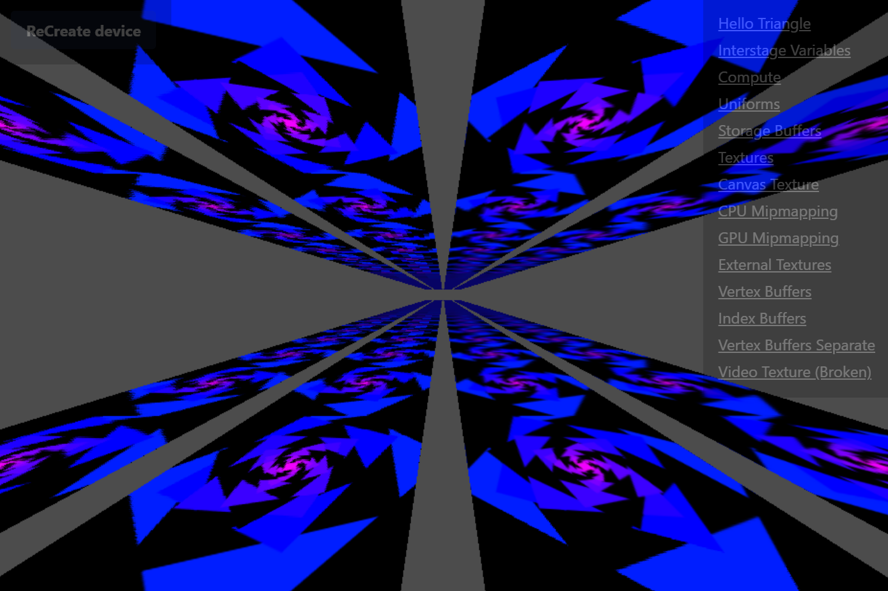
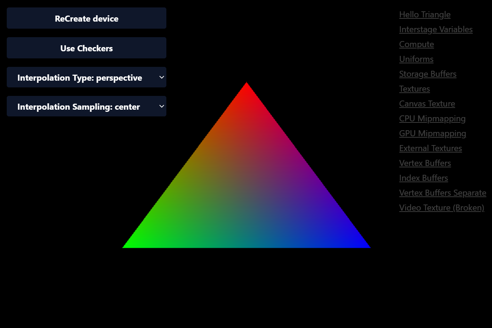
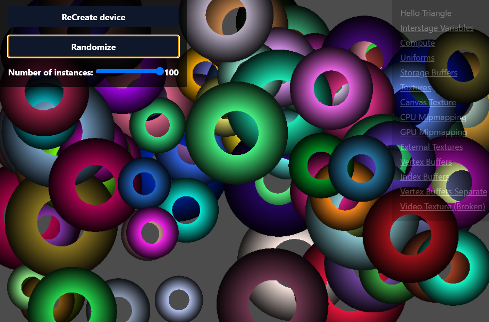
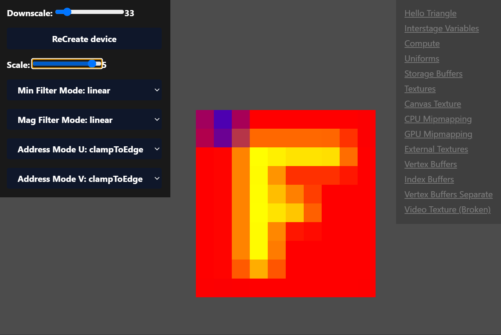
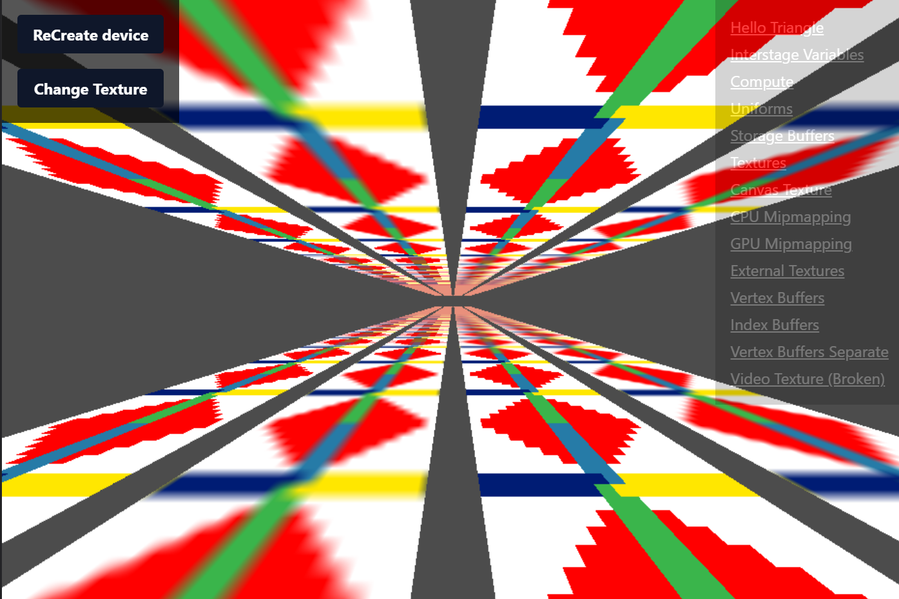

# WebGPU

See it live:

[react-webgpu.vercel.app](https://react-webgpu.vercel.app/)

This is a research project trying to evaluate how a declarative/reactive graphics engine would work.

It's basically following the [WebGPU Fundamentals](https://webgpufundamentals.org/) guide, while applying the preachings of [Steven Wittens](https://acko.net/about/) at [acko.net](https://acko.net) _(the site with the cool banner)_.



So instead of writing the demos in a imperative style, Im building a set of reactive hooks and components that would do the equivalent thing.

It uses ReactJS, but just as an reactive runtime, the ideas implemented here could work with any fiber-based declarative/reactive system. Using React also gives us the benefit of having stuff like NextJS and SSR to implement some truly wicked ideas like using the backend to store state, and using hydration to resume the app to an state where the user left off.

### Running the demo:

```
git clone git@github.com:mendes5/web-gpu-react.git
cd web-gpu-react
cp .env.example .env
nvm use
yarn
yarn dev
```

# Does it work?

Well yes, it works really well, actually better than I hoped, by switching from imperative to declarative/reactive you get so many features for free, that it's even hard to imagine working with imperative code again.

For example, you can mix so many concerns in one component, that heavily abstracted and layered architectures start to look like pure bureaucracy, take for example the Interstage variables demo:



It has the "Use Checkers" button and once you click it, it changes the shader that is used to render the image, how that is done?

```jsx
// an toggle hook that you can get from those
// react hooks libraries
const [enabled, toggle] = useToggle(false);

const shader = useShaderModule(
  // use the toggle value to create
  // a glsl using one shader string
  // or another
  enabled ? `WGSL code for rainbow shader` : `WGSL code for checkers shader`
);

// create a pipeline derived from the shader
const pipeline = useRenderPipeline(shader);

useFrame(() => {
  renderPass((encoder) => {
    // draw the elements using the pipeline
    encoder.setPipeline(pipeline);
    // ...
  });
});

return <button onClick={toggle}>Toggle shader</button>;
```

The actual code is a bit larger than that but the principle is the same: We are writing fully declarative code, we say we want a shader or another based on a toggle that is just a react hook controlled by an html button.

Try doing that in any other engine, (it might be easier actually), but this was pulled off with just a thin reactive wrapper around the WebGPU API instead of megabytes of code, you also **cannot** get more declarative than this.

One might say that I have the entire ReactJS working for me, but then again, that is actually the thing allowing this programming paradigm, it could probably be its own programming language optimized for fast compare between GC-managed values for efficient memoization. But that is a project for another day...

We are juggling like 3-5 concepts at any given time inside those components, like:

- Adding the button that changes the shader
- Creating the GPU resources, shaders/pipelines/command buffers/encoders
- Scheduling code to run per frame
- Doing the actual switch between shaders

> What about separation of concerns?

We probably should have it still, but being able to keep everything related to a piece of behavior inside a single component looks and feel so natural after you write a couple of those.

Imagine, being a game engine dev, and needing the mouse position inside some random shader uniform, you are right in the code that does the upload, but you can't just grab the mouse position out of thin air, you need to talk a bit to some `AbstractHDISystem` in order to get the actual value, after some testing and bug fixing you finally get the mouse position.

Here you would just `useCursorPosition()` inside the component.

I think [@mxstbr](https://twitter.com/mxstbr/status/993455977008594944?s=20) puts it better.


Just replace programming language with engine system.

# Handling device lost events

My favorite detail here is how well this architecture handle crashes. Normally if your rendering device is lost ou are out of luck, all your GPU state is lost, to get back at where you left off, you would need to restart the game or application.

Here the resources are "just created again" and the frame loop restart.

It works so well that I proudly display a `ReCreate Device` button in ALL of the demos, that when you click it, it calls `device.destroy()` which basically clears out everything on the GPU related to this rendering device.


What happens here? in the next frame the app will continue as if nothing had happen, you will get a white flash occasionally, but that is way better than having to restart the app.

And the best part is that **I didn't even had to do anything**, by just respecting the rules of the react hooks, the rules of memoization, clearing the effects properly and giving special attention to all async code, React just re-runs the parts of the code that notice the change of the `device` in their dependencies array, and just re-create everything in the next frame.

```
const pipeline = useMemo(() => {
  // Builds a render pipeline.
  // It depends on `device` and `shader`
  // If one of those changes
  // rebuild the pipeline
}, [shader, device])
```

Just apply this to everything and as if magic, the application survives crashes, without a scratch.

Not only that but it still keeps state everywhere after the crash, for example, here:



We have the randomize button, that changes the circles positions, and the number of instances slider that just limits how many items can be rendered at the time.

Since during a crash we don't unmount anything on the react tree, values like stuff in `useState`, `useRef` and `useMemo` are preserved, and used in the next frame.

## Plays well with hot reload too

Since we are using React properly, hot reload literally allow us to edit the shaders while the application is still running, the shaders will be hot-applied by mechanism already present since the first version of React.

You will get your shader and still get to keep your application state, so more having to fiddle with a bunch of options to get the UI back to how it should be to test your shader, like the image below:



All of those 6 values are kept between hot-reloads, it is a magical developer experience.

# The bad parts

There would be no way a system like this would pop from nowhere and offers only benefits, there is some bad things too.

My main issue right now is fighting with React's lack of support for conditionally rendering hooks, without it, im forced to take the decision `if (device !== null)` literally everywhere that device is used.

The alternative is making a:

```js
<GPUDeviceProvider value={device}>
  {device !== null ? children : fallback}
</GPUDeviceProvider>
```

But that will unmount the children in the event that the context is lost, that means that all the app state is lost, and the magic of hot-reload would go away too, it also would not render most of the page due to SSR.

So I need to pass it down, and render the children, even if device is null. So all my code end up looking like this:

```js
const resource = useMemo(() => {
    if (!device) return;
    // actual code...
}, [device, ...deps]);

const resource = useMemo(() => {
    if (!device) return;
    // actual code...
}, [device, ...deps]);

const resource = useMemo(() => {
    if (!device) return;
    // actual code...
}, [device, ...deps])l
```

I plan to solve this by hiding it behind "smart" hooks like `useMemoBag({device}, ({device}) => {...}, [])`, but they are tedious to manage.

Ideally I would be able to just not render any hooks and straight out render my children while still keeping my state:

```js
const Cube = () => {
    // fetch the current GPU device
    const device = useGPUDevice();

    // declare CPU state
    const ... = useState(0);
    const ... = useState(false);
    const ... = useRef([]);

    // early return if device is invalid
    if (!device) return <>{children}</>;

    // create GPU resources/state
    useShader(device);
    useShader(device);
    usePipeline(device);
    usePipeline(device);
    useCompute(device);
    useCompute(device);
    useBuffer(device);

    useFrame(() => {
      // draw
    });

    // late return
    return <>{children}</>;
}
```

Another problem that is not present now but will be later is how much of React + Javascript are bad for garbage collectors.

A single hook like this:

```js
useMemo(() => {}, [...deps]);
```

This allocates an entire function closure and array, that might not even being used. The issue will grow fast when your entire application uses code like this as it's primitives for controlling everything in fast-paced apps, in the short term you can use `React.memo` to avoid deep re-render chains to minimize the issue.

But again, maybe we need a new programming language, not just another one that has a new fresh syntax for if/else and for loops, but one that is thought from the ground up with fibers/declaratively/reactivity in mind, I was on the market for declarative/reactive based programming some time ago, but all I could find are more runtimes like React, or Skip, a programming language by Meta, whose site doesn't even has SSL/HTTPS

http://skiplang.com/

Its also not declarative nor has fibers, so it has half of the horse missing.

Until then, I will try to update this into another declarative/reactive toolbox for building 3D graphics.

Maybe someday you will be able to just `npm install wgpu-black-hole` and put a `<BlackHole />` anywhere inside your scenegraph, and have everything automatically wired up for you.


